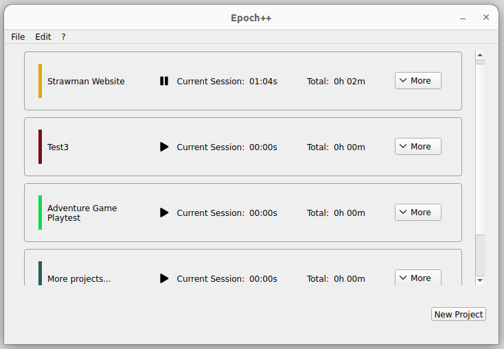

A minimal, cross-platform Time Tracking App made with C++ & Qt

On Ubuntu (GNOME):

## Features

### Roadmap
<u>VERSION 0.1</u>  
🗹 Create projects, save and load them from disk  
🗹 Edit project : rename, delete  
🗹 Start and stop session, added automatically to project  
🗹 Display project stats by processing sessions data  
🗹 Use colors to distringuish projects and assign new custom one via dialog picker  
🗹 Display "Edit" and "Stats" features inside a collapsable panel   
🗹 Manual add session (also for testing purpose)  

<u>VERSION 0.X</u>  
☐ Manual delete session (and maybe better, thus dedicated UI for Sessions handling? see below)  
☐ Better UI for sessions handling (manual add, delete, etc.)  
☐ Year active days and sessions count per day graph calendar (similar to GitHub/GitLab profiles)  
☐ Stacked widgets to differentiate stats and edit (maybe needed after having the calendar)?  
☐ Make project cards moveable (drag-and-drop)  

<u>VERSION 1.0</u>  
☐ Ensure basic tests  
☐ Ensure complete sessions uniqueness and reliability (input bugs, save bugs..)  
☐ Ensure project data reliability (input bugs, save bugs..)  

<u>TODO: LATER</u>  
☐ Rethink the window size policy (is set fixed for now for simplicity)  
☐ More flexibily with save files (edit save file location by user?)  

## Building and compatibility

Build with CMake.

Developed on Linux (Ubuntu) with QtCreator and Windows with VS2022 (Qt plugin and CMake support needed).

Tested on Linux Ubuntu and Windows 10.

#### Note
Qt projects built with CMake might have build issues related to the moc pipepline (the include of to-be-generated Qt' ui files). If so, you'll find the ui_*.h files in your /out/build directory that is generated at every CMake launch. This issue is especially happening on Windows, if you're using Visual Studio you might need to either : ***Reconfigure your project using CMake*** (and clean build) or ***clean the project (also possible to delete the build directory) and restart VS as it will trigger the necessay CMake rebuilding.***
